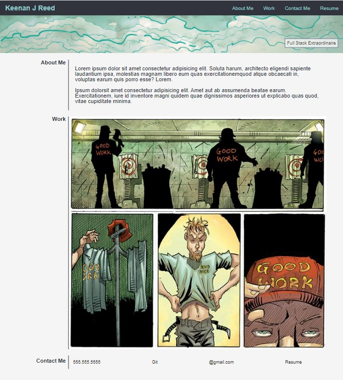
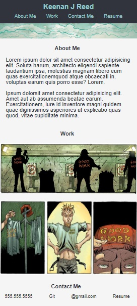

# Personal-Portfolio

##Description

I have developed a personal portfolio page meant to highlight my skills as a web developer. It is a responsive page that uses links, images, and text to highlight my growing abilities.

##Usage

When you click on the links they will anchor to their corresponding locations on the webpage. Also, when you decrease the size of the window all of the elements should be obvserved to respond dynamically and smoothly.

![Port Site Responsive] ()url

Format: 

##Credits

Both of my study groups were instrumental in the completion of this project and I really can’t thank them enough.

##URLs

Repo: https://github.com/AstralGnome/Personal-Portfolio.git

Deployed Application: https://astralgnome.github.io/Personal-Portfolio/

